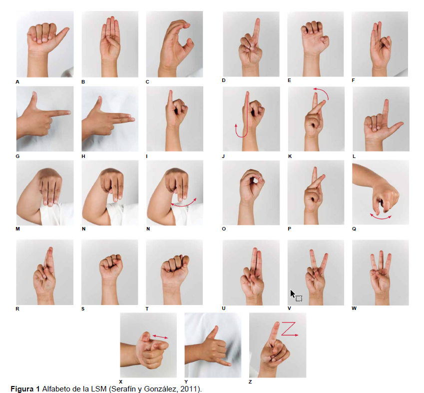

# AlphabethSignLanguange

In this repository there are two folders.

One of them is for develop the model using python, and the other one is to create the mobile app

<!-- Insert image Alphabet.png -->

## Folder to develop the model
https://drive.google.com/drive/folders/1cgRuVANXII3ChgGIRYGLIyGkR4ozRCKK?usp=drive_link

## Resources

Here are some resources:

https://www.youtube.com/watch?v=wuZtUMEiKWY&t=267s&ab_channel=Roboflow

https://www.youtube.com/watch?v=-UoSr9Z_Bg0&t=9s&ab_channel=MuhammadMoin

https://www.youtube.com/watch?v=Z7Z9pHF8wJc&ab_channel=Ultralytics

https://www.youtube.com/watch?v=qn96xC3LV2Y&t=61s&ab_channel=ArtificiallyIntelligent

https://www.youtube.com/watch?v=hg4oVgNq7Do&t=791s&ab_channel=Koby_n_Code

https://www.youtube.com/watch?v=ZgQOt2u6A7Q&ab_channel=DSwithBappy

https://www.youtube.com/watch?v=cHOOnb_o8ug&t=1352s&ab_channel=Pysource
