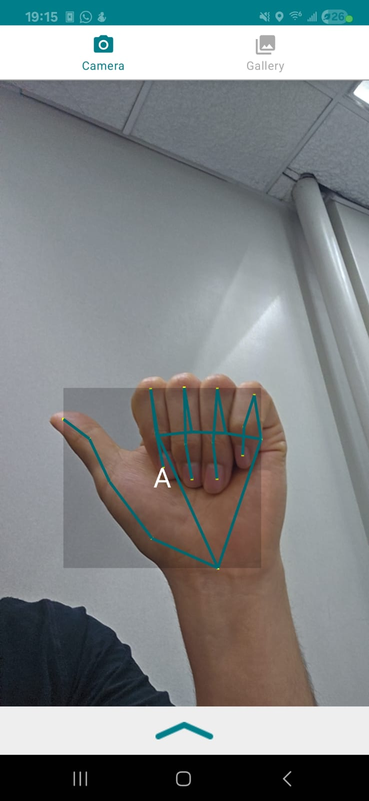

# Traductor de Lenguaje de Señas del Alfabeto a Texto (Android)

Este proyecto es una aplicación nativa para Android que puede reconocer y traducir en tiempo real el lenguaje de señas del alfabeto americano (ASL) a texto, utilizando la cámara del dispositivo.

## Demostración

Aquí puedes ver una demostración en video del funcionamiento de la aplicación en Android.

*(Aquí puedes insertar un GIF o un enlace a un video de YouTube)*

## Screenshots de la Interfaz

Vista principal de la aplicación en funcionamiento.

---

## ✨ Aplicación para Android ✨

Esta aplicación ofrece una experiencia de usuario fluida y en tiempo real, utilizando directamente el hardware de la cámara del dispositivo para una máxima eficiencia.

### Características Principales

* **Traducción en Tiempo Real:** Utiliza la cámara para capturar video e identificar gestos de manera instantánea.
* **Interfaz de Usuario Limpia:** Muestra el resultado de la clasificación (la letra detectada) de forma clara en la pantalla.
* **Alta Precisión:** Gracias al modelo de `Hand Landmarker` de MediaPipe y a un clasificador de puntos clave personalizado, la aplicación puede reconocer las letras del alfabeto con una notable precisión.
* **Nativa:** Construida en Kotlin, siguiendo las prácticas modernas de desarrollo de Android para garantizar el mejor rendimiento.

### ¿Cómo Funciona?

1.  **Captura de Cámara:** La aplicación accede a la cámara del dispositivo para obtener un flujo de video en vivo.
2.  **Detección de Manos con MediaPipe:** Cada fotograma del video es procesado por la tarea **`HandLandmarker`** de MediaPipe. Esta tarea detecta la presencia de una mano y extrae la posición de sus 21 puntos clave (landmarks) en coordenadas 3D.
3.  **Normalización de Puntos Clave:** Para que el modelo funcione independientemente del tamaño o la posición de la mano en la imagen, las coordenadas de los puntos clave se normalizan.
4.  **Clasificación de Gestos:** Los puntos normalizados se envían a un modelo de clasificación personalizado (`keypoint_classifier`). Este modelo, previamente entrenado, compara los datos de entrada con los patrones de cada letra del alfabeto y devuelve la letra más probable.
5.  **Visualización:** La letra reconocida se muestra en la interfaz de usuario de la aplicación.

### Estructura del Código Android

El código fuente de la aplicación de Android se encuentra en el directorio:
`mediapipe-samples/examples/hand_landmarker/android/`

Archivos clave a destacar:

* `HandLandmarkerHelper.kt`: Una clase de ayuda que gestiona toda la lógica de MediaPipe, desde la inicialización del detector hasta el procesamiento de imágenes y la devolución de los resultados.
* `KeyPointClassifier.kt`: Clase responsable de cargar el modelo de clasificación de gestos y ejecutar la inferencia sobre los landmarks detectados por MediaPipe.
* `CameraFragment.kt`: Gestiona la vista de la cámara, el ciclo de vida y la comunicación con `HandLandmarkerHelper`.
* `OverlayView.kt`: Una vista personalizada que se superpone a la vista previa de la cámara para dibujar los puntos clave y las conexiones de la mano detectada.

### Cómo Compilar y Ejecutar

1.  Abre el proyecto de Android ubicado en `mediapipe-samples/examples/hand_landmarker/android/` con Android Studio.
2.  Espera a que Gradle sincronice todas las dependencias del proyecto.
3.  Conecta un dispositivo Android físico (recomendado para usar la cámara).
4.  Selecciona el dispositivo y presiona "Run" (▶️) en Android Studio.

